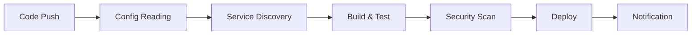

# CI/CD Pipeline Documentation - Educational Chatbot

This document describes the Continuous Integration and Continuous Deployment (CI/CD) pipeline for the Educational Chatbot application.

## 🚀 Pipeline Overview

The CI/CD pipeline is designed to automatically build, test, and deploy the Educational Chatbot application across multiple environments using a GitOps approach with ArgoCD.

### Pipeline Stages



## 📋 Pipeline Configuration

### 1. Configuration Reading (`config` job)
- Reads settings from `platform-requirements.yml`
- Extracts CI/CD configuration including:
  - Container registry settings
  - Image namespace and tagging strategy
  - Deployment branch mappings
  - Environment configurations

### 2. Service Discovery (`discover` job)
- Automatically scans the `src/` directory for Dockerfiles
- Identifies microservices (frontend, backend)
- Creates build matrix for parallel processing

### 3. Build and Push (`build` job)
- Builds Docker images for each discovered service
- Uses multi-platform builds (linux/amd64)
- Implements Docker layer caching for faster builds
- Tags images with SHA-based naming convention
- Pushes to configured container registry

### 4. Security Scanning (`security` job)
- Runs Trivy vulnerability scanner on built images
- Generates SARIF reports for GitHub Security tab
- Blocks deployment on critical vulnerabilities (configurable)

### 5. Deployment (`deploy` job)
- Updates Helm values with new image tags
- Commits changes back to repository
- Triggers ArgoCD sync for automatic deployment

### 6. Notification (`notify` job)
- Provides build and deployment summaries
- Reports job status and metrics
- Creates GitHub Actions summary

## 🌿 Branch Strategy

### Branch to Environment Mapping
- `main` → Production environment
- `develop` → Development environment
- `staging` → Staging environment

### Deployment Triggers
- **Automatic**: Pushes to configured deployment branches
- **Manual**: Workflow dispatch with environment selection
- **Pull Request**: Build and test only (no deployment)

## 🐳 Container Registry

### Image Naming Convention
```
Registry: docker.io
Namespace: spandaai/educational-chatbot
Tags: {service}-{sha8}
```

### Examples
- `docker.io/spandaai/educational-chatbot:frontend-a1b2c3d4`
- `docker.io/spandaai/educational-chatbot:backend-e5f6g7h8`

## 🔐 Secrets Management

### Required GitHub Secrets
- `DOCKERHUB_USERNAME`: Docker Hub username
- `DOCKERHUB_TOKEN`: Docker Hub access token

### Optional Secrets (per environment)
- `KUBECONFIG_DEV`: Kubernetes config for dev environment
- `KUBECONFIG_STAGING`: Kubernetes config for staging environment
- `KUBECONFIG_PRODUCTION`: Kubernetes config for production environment

## 📊 Monitoring and Observability

### Build Metrics
- Build duration and success rates
- Image size and layer efficiency
- Security scan results and trends

### Deployment Metrics
- Deployment frequency and lead time
- Mean time to recovery (MTTR)
- Change failure rate

## 🛠️ Customization

### Platform Requirements Configuration

```yaml
# CI/CD specific configuration in platform-requirements.yml
cicd:
  registry_host: "docker.io"
  image_namespace: "spandaai/educational-chatbot"
  source_directory: "src/"
  
  deployment_branches:
    - "main"
    - "develop"
    - "staging"
  
  registry_credentials:
    username_secret: "DOCKERHUB_USERNAME"
    password_secret: "DOCKERHUB_TOKEN"
  
  tagging_strategy:
    type: "sha-based"
    format: "{service}-{sha}"
    include_latest: false
  
  environment_mapping:
    main: "production"
    develop: "dev"
    staging: "staging"
```

### Workflow Customization

The workflow can be customized by modifying `.github/workflows/ci-cd.yml`:

- **Build Matrix**: Add or remove services
- **Test Stages**: Add integration or E2E tests
- **Security Policies**: Configure vulnerability thresholds
- **Deployment Strategies**: Implement blue-green or canary deployments

## 🏃 Running the Pipeline

### Automatic Triggers
1. Push code to deployment branch
2. Pipeline automatically starts
3. Monitor progress in GitHub Actions tab
4. Check deployment status in ArgoCD

### Manual Triggers
1. Go to GitHub Actions tab
2. Select "Build and Deploy Educational Chatbot" workflow
3. Click "Run workflow"
4. Select branch and environment
5. Click "Run workflow"

## 🔧 Troubleshooting

### Common Issues

**Build Failures**
- Check Dockerfile syntax and dependencies
- Verify base image availability
- Review build logs for specific errors

**Registry Push Failures**
- Verify registry credentials
- Check image naming conventions
- Ensure registry permissions

**Deployment Failures**
- Check Helm values syntax
- Verify Kubernetes cluster connectivity
- Review ArgoCD application status

**Security Scan Failures**
- Review vulnerability reports
- Update base images and dependencies
- Consider vulnerability exceptions for non-critical issues

### Debug Commands

```bash
# Local build testing
docker build -t test-frontend ./src/frontend
docker build -t test-backend ./src/backend

# Helm validation
helm lint ./deploy/helm
helm template test ./deploy/helm --values ./deploy/helm/values-dev.yaml

# Registry connectivity
docker login docker.io
docker push docker.io/spandaai/educational-chatbot:test
```

## 📈 Performance Optimization

### Build Speed
- Docker layer caching enabled
- Multi-stage builds for smaller images
- Parallel service builds

### Resource Usage
- Optimized resource limits per job
- Cleanup of temporary artifacts
- Efficient image layering

### Security
- Minimal base images (Alpine Linux)
- Non-root user containers
- Regular security updates

## 🔄 GitOps Integration

### ArgoCD Configuration
- Application auto-sync enabled
- Self-healing for configuration drift
- Rollback capabilities for failed deployments

### Helm Chart Management
- Environment-specific value overrides
- Automated image tag updates
- Configuration validation

### Monitoring Integration
- Prometheus metrics collection
- Grafana dashboard automation
- Alert manager integration

## 📚 Additional Resources

- [Platform Requirements Documentation](PLATFORM-REQUIREMENTS.md)
- [Helm Chart Documentation](deploy/helm/README.md)
- [ArgoCD Best Practices](docs/argocd-best-practices.md)
- [Security Guidelines](docs/security-guidelines.md)

---

For questions or support with the CI/CD pipeline, contact the Platform Team or create an issue in the repository.
